# 👋 Hi, I'm Chirag Goyal

### Software Developer • Backend • Full-Stack • Cloud • AI/ML

  

---

## 🚀 About Me

I'm a **Computer Science graduate specializing in backend and full-stack software development**, with hands-on experience building REST APIs, microservices, fintech workflows, mobile applications and AI/ML projects.

- 💼 **Graduate Intern @ Zeta** — Java, Spring Boot, REST APIs, microservices and fintech
- 🎓 **B.Tech — Artificial Intelligence & Machine Learning**, B.M.S. College of Engineering
- 🏗️ Interested in **backend engineering, distributed systems, cloud, DevOps and system design**
- 🧠 Strong foundation in **DSA, OOP, DBMS, OS and Computer Networks**
- 📍 **Open to Software Developer opportunities across India**

> **I enjoy turning complex requirements into clean, scalable and production-oriented software.**

---

## 💼 Experience

### 🏢 Zeta — Graduate Intern
**Jan 2026 – Jun 2026 · Bangalore, India**

| Impact | What I worked on |
|---|---|
| ⚡ **50% reduction** | Built an automated API testing framework, reducing manual QA effort |
| 🏗️ **Microservices** | Developed Java + Spring Boot REST APIs for fintech workflows |
| 💳 **Multi-tenant platform** | Worked on a configurable credit-card platform supporting multiple client deployments |
| 📡 **Event-driven systems** | Integrated Kafka, FCM and MoEngage for notifications and customer engagement |

---

## 🔥 Featured Projects

| 🚀 Project | 💡 What it does | 🛠️ Technology | 🔗 Links |
|---|---|---|---|
| 📅 **MeetGrid** | Meeting scheduling with availability, bookings, calendars, payments & notifications | Java · Spring Boot · PostgreSQL · Docker | [**Live Demo**](https://meetgrid.onrender.com) · [**GitHub**](https://github.com/chiraggoyal11/meetgrid) |
| 📝 **DeNote** | Decentralized notes/files with IPFS storage and PDF handling | Jetpack Compose · Node.js · MongoDB · IPFS | [**Live Demo**](https://de-note-theta.vercel.app) · [**GitHub**](https://github.com/chiraggoyal11/DeNote) |
| 🟣 **Violet** | Full-stack e-commerce Android application | Java · Android · Node.js · MongoDB · AWS S3 · JWT | [**Live Demo**](https://violet-psi.vercel.app/) · [**GitHub**](https://github.com/chiraggoyal11/Violet) |
| 🩺 **Kidney Stone Detector** | Computer-vision / deep-learning based detection application | Python · PyTorch · OpenCV | [**Live Demo**](https://kidney-stone-detector-frontend.onrender.com/) · [**GitHub**](https://github.com/chiraggoyal11/Kidney-Stone-Detector) |
| 🧠 **Semantic Analyzer** | NLP / machine-learning project for semantic analysis | Python · NLP · ML | [**GitHub**](https://github.com/chiraggoyal11/Semantic-Analyzer) |

### 📅 MeetGrid
**Java 21 · Spring Boot · PostgreSQL · Docker · REST APIs · Razorpay · Google Calendar · Resend**

A meeting scheduling platform where hosts publish booking pages and guests choose available time slots. Includes availability rules, buffers, booking limits, blocked dates, rescheduling/cancellation, calendar integration, email notifications and paid booking flows.

**Highlights:**
- 📆 Flexible availability and booking rules
- 🔄 Rescheduling and cancellation workflows
- 📅 Google Calendar integration
- 💳 Paid booking flow with Razorpay
- 📧 Email notifications with Resend
- 🐳 Dockerized Java/Spring Boot backend

### 📝 DeNote
**Jetpack Compose · Node.js · Express · MongoDB · IPFS · Pinata · Multer**

A decentralized notes/file application combining a modern Android UI with IPFS-based storage.

**Highlights:**
- 🌐 Pinata + IPFS based decentralized file storage
- 📁 Node.js/Express backend with MongoDB and Multer
- 📄 PDF preview and caching
- ⚡ Reduced repeat loading through local caching

### 🟣 Violet
**Java · XML · Material Design · Node.js · Express · MongoDB · AWS S3 · Retrofit · JWT**

A full-stack e-commerce Android application with a dedicated backend and cloud storage.

**Highlights:**
- 📱 12+ screen Android UI
- 🔐 JWT authentication
- ☁️ AWS S3 integration
- 🗄️ Optimized MongoDB schemas
- 🔌 Retrofit-based API integration and local caching

### 🩺 Kidney Stone Detector
**Python · PyTorch · OpenCV**

AI/ML application using computer vision and deep-learning technologies for kidney-stone detection.

### 🧠 Semantic Analyzer
**Python · NLP · Machine Learning**

NLP/ML project focused on semantic analysis and language-processing workflows.

---

## 🛠️ Technical Skills

### 💻 Languages & Programming

### ⚙️ Backend, APIs & Architecture

### 📱 Android & Mobile

### 🤖 AI / ML / Data Science

### 🗄️ Databases & Storage

### ☁️ Cloud, DevOps & Distributed Systems

### 🧪 Testing, Engineering & Developer Tools

---

## 🧠 Core Computer Science

`DSA` · `OOP` · `DBMS` · `RDBMS` · `Operating Systems` · `Computer Networks` · `Machine Learning` · `Deep Learning` · `System Design` · `SDLC`

---

## 📊 GitHub Analytics

 

---

## 🏆 GitHub Achievements

---

## 🐍 Contribution Activity

<strong>My GitHub contribution activity</strong>

---

## 🏆 Certifications

- **Java Programming Certificate** — Udemy / In28minutes · March 2026
- **React JS – Skill Development Program** — BMSCE ACM Student Chapter · May 2025

---

## 📄 Resume

---

## 🤝 Open to Opportunities

### 💼 Software Developer · Backend Developer · Full-Stack Developer

**Java • Spring Boot • Node.js • React • Cloud • AI/ML**

I'm currently open to **full-time software development opportunities** and can relocate across India.

---

## 🌐 Connect With Me

---

### 🚀 Build. Learn. Ship. Repeat.

**Thanks for visiting my profile! ⭐**

